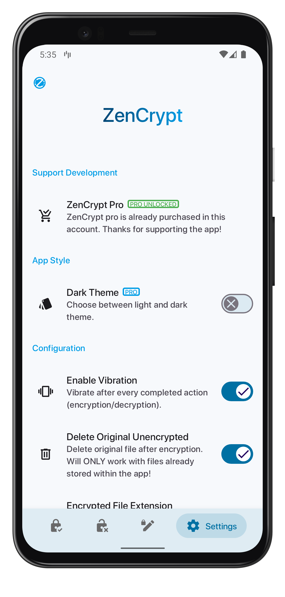
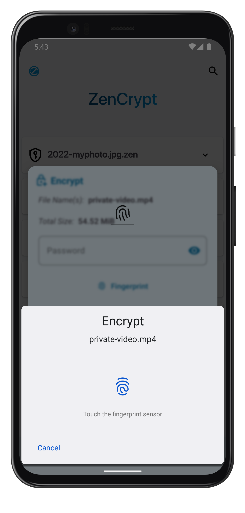
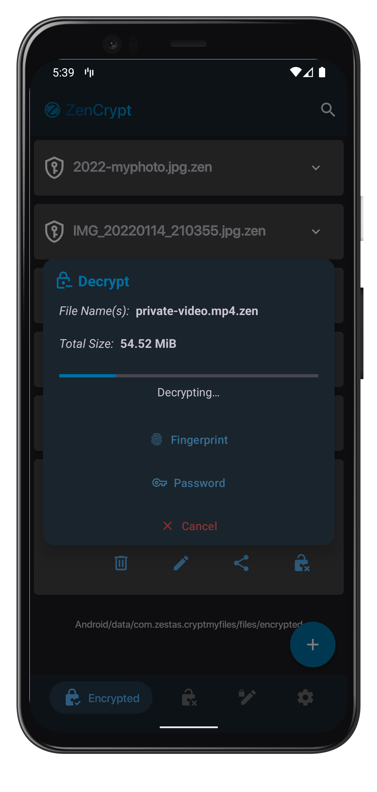
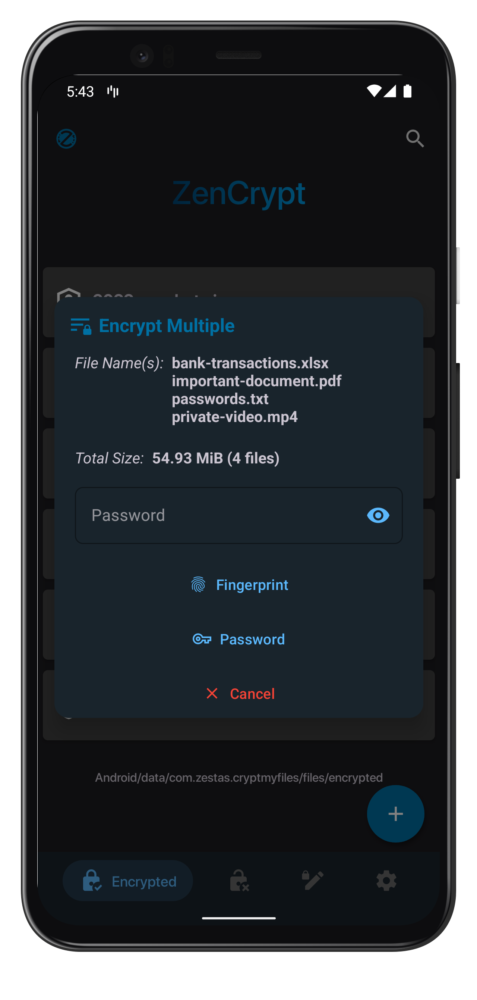
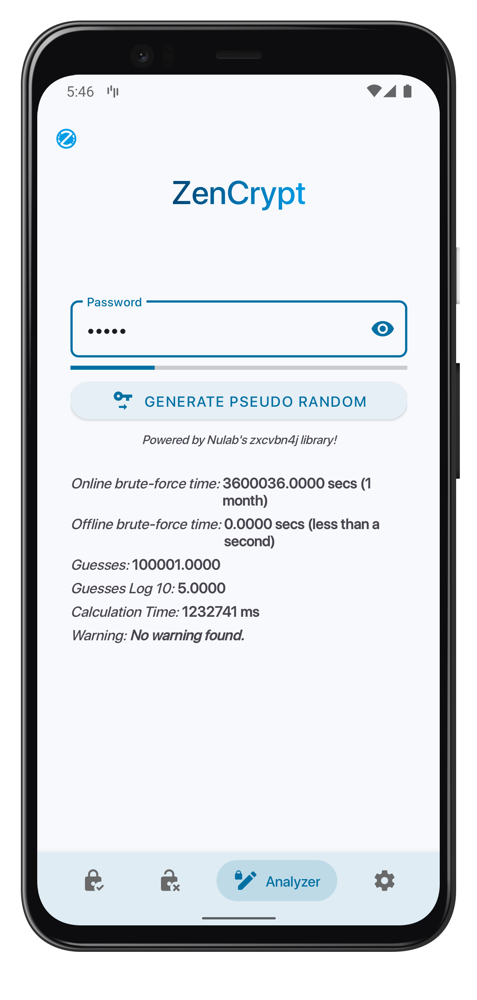

# About

Welcome to ZenCrypt. With this app, you can safely encrypt files, using a secure and efficient library.
Zencrypt offers AES-256 encryption algorithm, CBC mode of operations, block padding with PKCS7, computationally secure random salt (of cipher block size), password stretching with PBKDF2, random IV generation on each encryption (16 bytes), and password analysis for strength, crack times, weakness, etc using nulab\'s zxcvbn4j library. Finally, the application does not leak (tested with LeakCanary), and has no internet connection permission (except for google play billing library, which is required for purchasing pro version). You can check the encryption library's source code below. Credits go to Priyank Vasa (EasyCrypt) on github.

# Download
You can either download the source and built it yourself on Android Studio, or directly download ZenCrypt from Google Play.

    

# Screenshots

